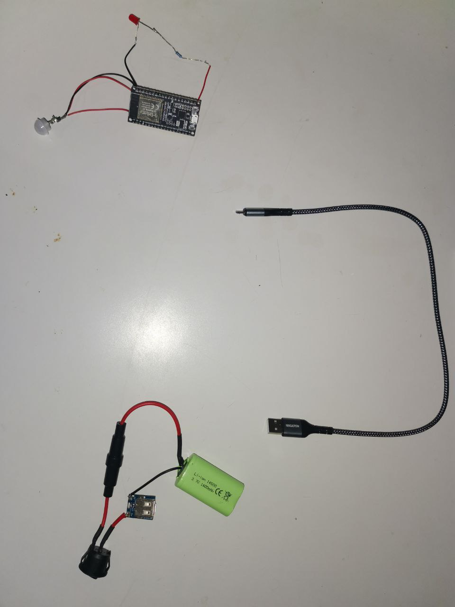

# PIR-Communicator

My DIY project to protect a room from unauthorized access))

[Preview Video ](https://drive.google.com/file/d/1OLRuA5nBzqJ-8at_WL5AkTt9_fnpMwa0/view?usp=sharing) 

Don't judge me too harshly, this is my first time making a case for a project, despite the fact that 
it turned out badly (on the video), it doesn't affect the work and still I think that a good case is 
80% of success.

This project was created for me in mind, in the sense that all my creation does is detect motion
and send me a message on Telegram while I'm away. Considering that I have the phone numbers of the people 
I live with, I can, upon receiving a message, ask them what they're doing in my room.
In addition to this project, you can add an alarm system and video surveillance.

We'll start with a diagram I sketched out in the first program I found on the internet
(because I don't do projects often and it's expensive). 

Here it is:

🔧How it works and its features🔧:
In the code, the ESP32 is connected to WiFi and a Telegram bot that also needs to be connected. 
Messages are sent every 15 seconds (the pause is not performed with the "deley" command, but with the 
"millis" command to prevent the entire system from shutting down during this period).

If you have the Chinese version of the ESP32, you'll encounter an error uploading a sketch. 
To resolve this, hold down the Boot button while uploading and press the Reset button to start the program.

⚡Basic materials⚡: 
I divided the circuit into two small blocks. 
 The first contains the battery, fuse, switch, and 5V step-up module. 
 It has a USB port for powering the ESP32 and a mini-USB port for charging the battery.
 (The circuit is designed in such a way that the battery will only charge when the switch is on.)

I mounted the components using double-sided tape/3M
 
 And the second one contains the controller itself, a 220 Ohm resistor, an LED, and the main PIR sensor AM312

And a simple connection of two circuits with a USB to USB B mini cable

All components + Thermal shrink

And the final result of soldering

⬆️Improvement points⬆️:
First of all,you need to find a suitable case, think over the layout of the components, and their separation
(battery, microcontroller) and outputs.
And from the case and correct planning, carry out soldering so that there are no long wires.
In addition to this project, you can add an alarm system and video surveillance.
  
The cable that connects the two circuits could be twisted into a circle and pushed inside the case

⚠️Security Tips⚠️:
Do not share your Wi-Fi login and password.
When choosing a battery, look for one with a protection board.

There will be no sketch for security reasons, just ask for help in GPT chat)))

 
