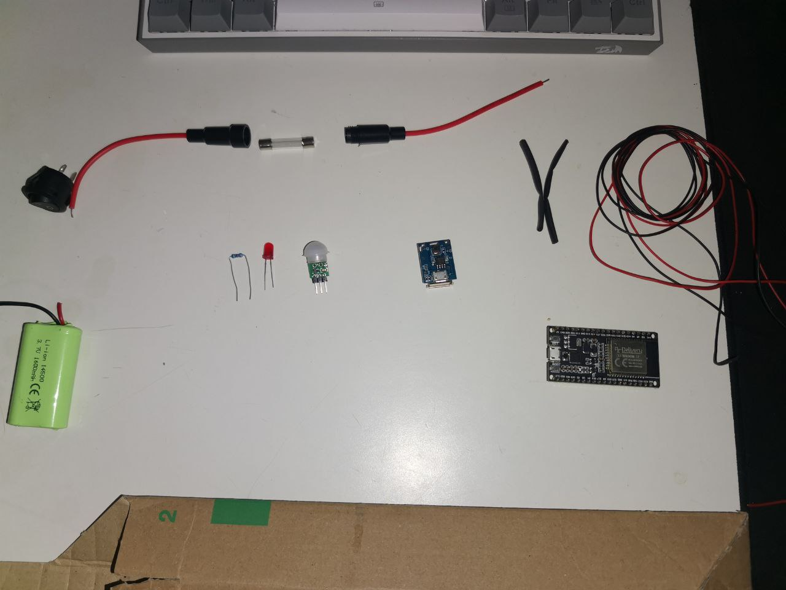

# PIR-Communicator

My DIY project to protect a room from unauthorized access))

[Preview Video ](https://drive.google.com/file/d/1OLRuA5nBzqJ-8at_WL5AkTt9_fnpMwa0/view?usp=sharing) 

Don't judge me too harshly, this is my first time making a case for a project, despite the fact that 
it turned out badly (on the video), it doesn't affect the work and still I think that a good case is 
80% of success.

We'll start with a diagram I sketched out in the first program I found on the internet
(because I don't do projects often and it's expensive). 

Here it is:

I divided the circuit into two small blocks. 
 The first contains the battery, fuse, switch, and 5V step-up module. 
 It has a USB port for powering the ESP32 and a mini-USB port for charging the battery.
 (The circuit is designed in such a way that the battery will only charge when the switch is on.)

 And the second one contains the controller itself, a 220 ohm resistor, an LED, and the main PIR sensor AM312

 And a simple connection of two circuits via a USB to USB B mini cable

 
 
